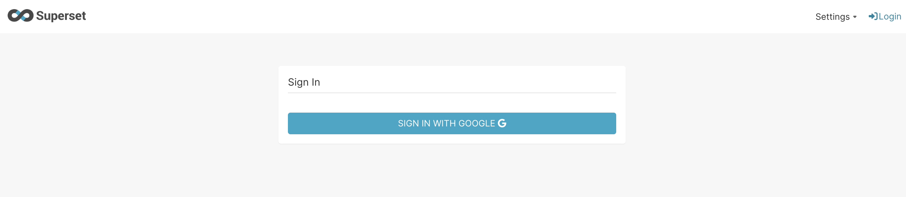

## Superset OAuth2

This is a guide to set up Superset with Google OAuth2.

### Considerations

- To configure SSO - deploying Superset behind a reverse proxy (e.g. Nginx) and using SSL is recommended. [Read More](https://superset.apache.org/docs/installation/configuring-superset/#configuration-behind-a-load-balancer)
- Here I used [Cloudflare Tunnel](https://www.cloudflare.com/en-gb/products/tunnel/) as a reverse proxy to expose Superset to the internet with HTTPS.
- I have used [Google OAuth](https://developers.google.com/identity/protocols/oauth2) for this guide, but superset can be configured with other OAuth providers as well. (Microsoft, Github, etc.)

### Running the project locally

#### Prerequisites

- Cloudflare Tunnel. Please follow the steps mentioned [here](https://youtu.be/ey4u7OUAF3c) by NetworkChuck on YouTube. Get a `cloudflare access token` from Zero Trust.

- Google OAuth Client ID and Secret. Please follow this [guide](https://developers.google.com/identity/protocols/oauth2/web-server).

- Please use `amd64` architecture for running this project. Encountered runtime issues with M1 Mac (arm64 architecture) as `superset` images are unavailable for `arm64`, the version used in this project.

#### Setting up environment variables

Create a `.env` file in the root of the project and add the variables from `.env.sample` file. Please replace the following variables with your own values.

```bash
CLOUDFLARE_TOKEN=
GOOGLE_OAUTH_CLIENT_ID=
GOOGLE_OAUTH_CLIENT_SECRET=
```

#### Add `redirect_url` to Google OAuth Console

Add the following URL to the `Authorized redirect URIs` in the Google OAuth console. [Read More](https://superset.apache.org/docs/installation/configuring-superset/#custom-oauth2-configuration)

```
https://<cloudflare-tunnel-url>/oauth-authorized/google
```

#### Running Superset with Docker Compose

```bash
docker-compose up -d
```

#### Access Superset

Access Superset at `https://<cloudflare-tunnel-url>`



---

### Recommended Reading

- [Superset OAuth2 Configuration](https://superset.apache.org/docs/installation/configuring-superset/#custom-oauth2-configuration)
- [Superset behind a Load Balancer](https://superset.apache.org/docs/installation/configuring-superset/#configuration-behind-a-load-balancer)
- [Superset Metadata Database](https://superset.apache.org/docs/installation/configuring-superset/#using-a-production-metastore)
- [Google OpenID Configuration](https://accounts.google.com/.well-known/openid-configuration)
- [Get User Info from Google OAuth](https://stackoverflow.com/questions/7130648/get-user-info-via-google-api)
- [Google OpenID Connect Docs](https://developers.google.com/identity/openid-connect/openid-connect#obtaininguserprofileinformation)

---

Made with ❤️ by [nil1729](https://github.com/nil1729)
